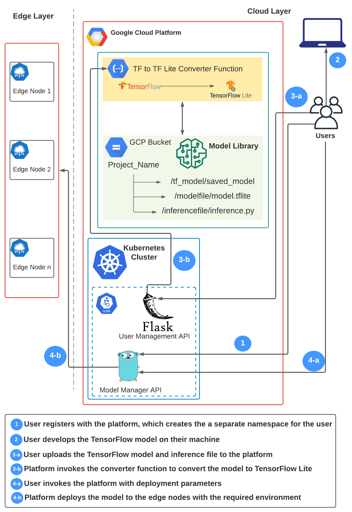

# edge-computing-platform-for-deep-learning-apps
This is the code repository for CMPE295 Masters Project. Part of the curriculum for Masters in Software Engineering at San Jose State University.

### Architecture Diagram


### Prerequisites:
- Enable the GCP APIs: Cloud Functions, Cloud Build, Storage, Virtual Machine, VPC, IAM, Cloud SQL
- If you're enabling the APIs for the first time, wait ~20-30 minutes before applying Terraform. The GCP API activation does not take immediate effect
- Install gsutil, gcloud locally
- Ensure ```make``` is installed 
- Login to DockerHub account (if you want to push the platform images to your own DockerHub account)

### Steps to deploy the cluster
1. Create an account on Google Cloud Platform and create a project. This project is where all the infrastructure resources will be created.
2. Go to the [service account key page in the Cloud Console](https://console.cloud.google.com/apis/credentials/serviceaccountkey) and create a new service account with Project -> Owner role. Download the credentials file in JSON format.
3. Enable the GCP APIs: Storage, Compute Engine, VPC, IAM. If you're enabling the APIs for the first time, wait ~20-30 minutes before applying Terraform. The GCP API activation does not take immediate effect.
4. Clone this repo 
```
git clone https://github.com/itselavia/edge-computing-platform-for-deep-learning-apps
```
5. cd into the repository
6. Edit the file named “terraform.tfvars” inside the infra/terraform fodler with the following required parameters:
    1. region: the GCP region where all the resources will be created
    2. vpc_name: the name for the virtual private cloud network
    3. zone: the GCP zone where all the resources will be created. The zone must be in the same region as declared in step 6.1
    4. project_name: name of the GCP project which was created in step 1
    5. k8s_worker_node_count: number of worker nodes to be created for the Kubernetes cluster
    6. edge_node_count: number of edge nodes to be created for the KubeEdge cluster
    7. credentials_file_location: path to the JSON credentials file downloaded in Step 2
    8. ssh_user: The SSH username which will be created in the VMs <br>
- Example terraform.tfvars file:
```
region                    = "us-west2"
vpc_name                  = "kubeedge-infra"
zone                      = "us-west2-a"
project_name              = "deploy-kubeedge-gcp"
k8s_worker_node_count     = 1
edge_node_count           = 1
credentials_file_location = "~/Downloads/deploy-kubeedge-gcp-19242787b5a4.json"
ssh_username              = "akshay"
```
7. Install Terraform by following the steps mentioned in the [official documentation](https://learn.hashicorp.com/tutorials/terraform/install-cli)
8. Run ```make cluster-init``` to initialize the and import the Terraform modules into the working directory
9. Run ```make cluster-plan``` to view all the infrastructure components Terraform will create in Google Cloud
10. Run ```make cluster-deploy``` which will start creating the cluster infrastructure on GCP.
10. Run ```make deploy-services``` to deploy the platform microservices to the Kubernetes cluster
11. The output of the previous step will contain the public address to access the model manager service. Paths can be assecced as: http://K8S_WORKER_NODE_IP/getAllPods
12. The kubeconfig file for the Kubernetes cluster is downloaded to infra/terraform/modules/kubernetes/config. Run the following command to setup KUBECONFIG
```
export KUBECONFIG=`pwd`/infra/terraform/modules/kubernetes/config
```
13. Run ```kubectl get nodes``` to see the worker nodes and edge nodes of the cluster
14. If the nodes are not visible, it’s possible that the cluster setup is still in progress. To view the logs for cluster setup, ssh into the node via the GCP Virtual Machines UI, and tail the /var/log/user-data.log file on any node.
15. If you want to add or remove any nodes from the existing cluster, simply edit the “terraform.tfvars” file with desired values for variables ```k8s_worker_node_count``` or/and ```edge_node_count``` and run ```make cluster-deploy```
16. To connect to the MYSQL database from your terminal:
```mysql --host=`terraform -chdir=infra/terraform output database_ip` --user=USERNAME --password```

### User Workflow


#### Notes:
- GCP doesn't handle renaming resources well enough. For example, if you're deleting and recreating a service account, it's better to give a new name to the new service account.

#### Miscelleanous commands
- kubectl label node k8s-worker-0 type=worker
- curl -X POST "https://us-west2-edge-platform-cmpe-295b.cloudfunctions.net/tf-to-tflite-converter-function" -H "Content-Type:application/json" --data '{"saved_model_dir_gcs":"sample_tf_model"}'
- curl -X POST "http://localhost:8000/convertModel?email=akshay.elavia%40gmail.com" -H  "accept: application/json" -H  "Content-Type: application/json" -d '{"model_folder_name": "sample_tf_model",  "project_name": "Sample_Project"}'
- curl -X POST "http://35.235.110.141:32000/deployModel?email=indiana.jones%40gmail.com" -H  "accept: application/json" -H  "Content-Type: application/json" --data '{"deployment_name":"test-deployment", "num_replicas": 2, "project_name": "object-detection"}'
